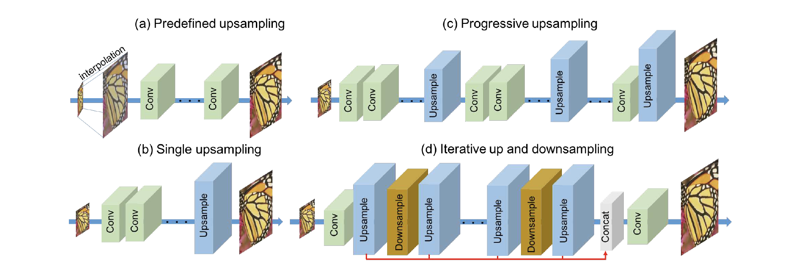
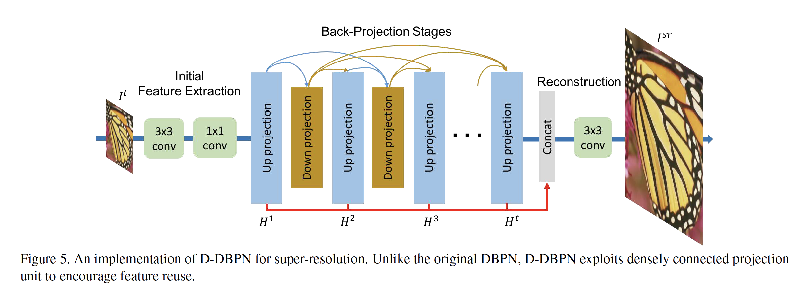

论文名：Deep Back-Projection Networks For Super-Resolution

作者所在团队：Toyota Technological Institute,Toyota Technological Institute at Chicago, United States

摘要：最近的前馈（feed-forward）式网络来学习低分辨率图像到高分辨率图像之间的非线性映射。

然而，这种方法没有解决低分辨率图像与高分辨率图像之间的互相依赖关系。因此，作者提出了一种Deep Back-Projection Networks，这种方法迭代的使用上采样和下采样层，在每个阶段提供了错误反馈机制。

贡献：

* 错误反馈机制（Error feedback）

* 上采样和下采样阶段相互相连（Mutually connected up- and down-sampling startsges）

* 深度相连（Deep concavenation）

* 使用Densenet 的方式提升（Improvement with dense connection）

SR网络分类：

* Predefined upsampling （a）
  * 一般的超分辩率方法先将LR图像通过interpolations插值方法上采样得到middle resolution（MR）图像。然后再学习MR-to-HR的非线性映射关系，这种方法首先是[SRCNN](SRCNN.md)中提出的。随后基于这种方法，残差学习（residual learning）和递归（recursive layers）被提出。
  * 然而，这种方法在生成MR图像的时候会产生大量的噪声（noise）。
* Single upsampling（b）
  * 这是一种增加空间（spatial）分辨率简单有效的方法。这种方法由FSRCNN和ESPCN提出。
  * 但是这种方法受限于网络的容量很难学习复杂的非线性映射关系。
  * EDSR赢得了NTIRE2017比赛，然而在每一层都需要大量的fiter以及需要8天的训练时间。
  * 这些问题使得可以保持同样效果的轻量化网络有了机会。
* Progressive upsampling（c）
  * LapSRN提出的这种渐进的重构不同因子的SR图像。
  * 简单的来说这是多个单一上采样（single upsampling）网络的集合。
  * 因此这种网络在8x放大因子的时候，甚至比作者提出的方法更好。
* Iterative up and downsampling（d）
  * 这种方法是本文提出的方法，作者关注不同深度SR特征的采样率以及将计算重构损失的任务分配到每个阶段。
  * 这种形式可以通过学习多种上下采样操作来保持HR成分并且构建更深的特征。

网络结构：

网络分为三个阶段：

（1）初始特征提取（Initial Feature Extraction）

首先使用一个3x3的卷积核提取feature，然后使用1x1的卷积核进行降维。

（2）反馈投影阶段（Back-Projection Stages）

（3）重构（Reconstruction）

最后使用3x3的卷积核进行重构。