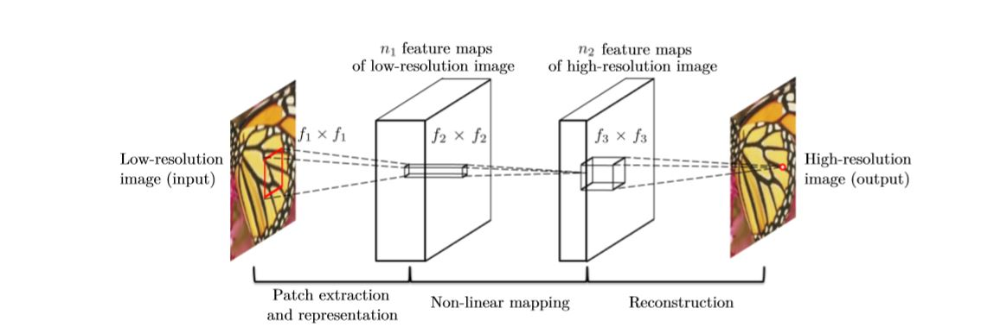
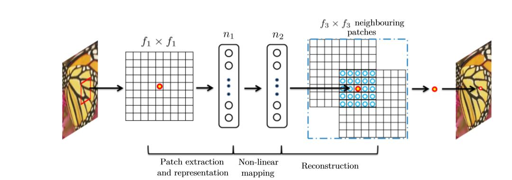

# SRCNN

【整理时间】2019.11.24

【论文题目】Image Super-Resolution Using Deep Convolutional Network.

【作者介绍】

**Chao Dong** 

* Beijing Institute of Technology,BS degree,2011

* University of Hongkong,PhD degree,

* interest include image super-resolution and denoising

**Chen Change Loy** 

* Queen Mary University of London in 2010，PhD degree
* Chinese University of Hong Kong，Assistant Professor

*　interests include computer vision and pattern recognition

**Kaiming He** 

* 2007, Tsinghua University, BS degree
* 2011,Chinese University of Hong Kong, PhD degree
* 2011,Microsoft Research Asia
* Best Paper Award(CVPR 2009)
* a member of the IEEE.
* interests include computer vision and computer graphics.

**Xiaoou Tang** 

* 1990,the University of Science and Technology of China, Hefei, BS degree
* 1991,the University of Rochester, New York,MS degree
* 1996, the Massachusetts Institute of Technology, Cambridge,PhD degree
* the Chinese University of Hong Kong,professor
* 2005-2008,Microsoft Research Asia,Group Manager
* interests include computer vision,pattern recognition and video processing
* the Best Paper Award (CVPR) 2009
* the program chair (ICCV) 2009
* IEEE fellow

【解决问题】

使用CNN直接学习低分辨率图像到高分辨率图像之间端到端的非线性映射。替代传统方法学习LR dictionary—>HR dictionary 隐性学习的方式。

【研究内容】

1.提出了一种使用CNN超分的方法，该CNN可以直接学习LR map到HR map的非线性关系。

2.探索了基于样例学习（example learning）与传统稀疏编码（traditional sparse-coding-based SR）方法的关系。并基于此关系来设计神经网络。

3.证明了深度学习对超分问题的有效性，加快超分任务的速度的同时，可以取得更好的超分辨率图像质量。

【网络结构】

* patch extraction and representation
* Non-linear mapping
* Reconstruction

【损失函数】MSE

【实验结果】

【结论】

提出了一种新的SISR方法，可以显式的学习低分辨率到高分辨率图像的非线性映射关系，并且无需额外的图像处理。具有较高的鲁棒性，可以将此模型应用到其他low-level vision领域。如deblurring或者同时SR+denoising。 

【思考】

SRCNN是使用CNN来处理超分任务的第一篇论文，对深度学习在超分任务的发展具有重大的意义。其网络结构仅由三层构成，特征提取层、非线性映射层或重构层。SRCNN首先使用双三次插值（bicubic）方法将LR图像上采样到HR，再将图像输入到CNN中。这样带来的结果是CNN具有更强的学习能力，但同时也带来了更大的计算量，由于CNN层数较少，也比现在的方法快速很多。