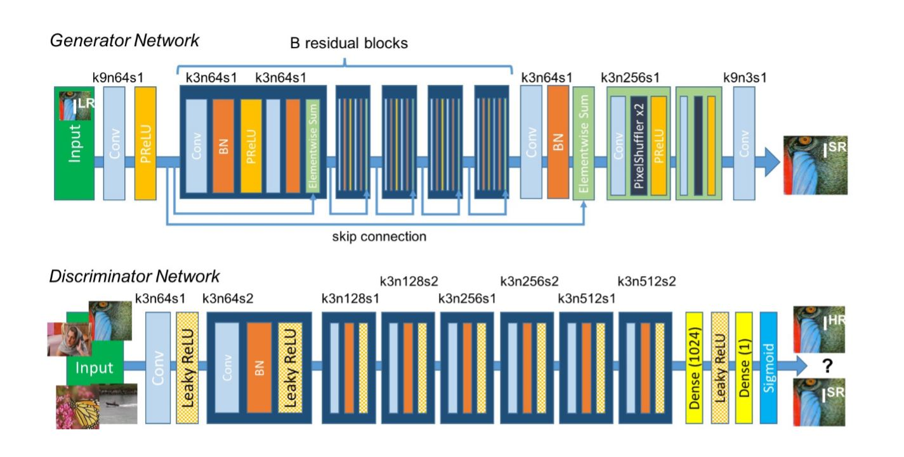

# SRGAN

【整理时间】2019.11.28

【论文题目】Photo-Realistic Single Image Super-Resolution Using a Generative Adversarial Network

【作者】 Christian Ledig，Lucas Theis...    (Twitter)

【会议】ECCV 2017

【解决问题】

MSE loss是一种像素级（Pixel-wise）的损失函数，在最小化MSE loss时容易丢失如纹理的高频信息，最后的结果也是过于平滑的，并且感知（perceptual）质量往往一般。

那么在超分时，更大的放大因子（4x）如何恢复更好的纹理细节？

针对此问题，作者提出了一种由对抗损失（adversarial loss）和内容损失（content loss）组成的感知损失（perceptual loss）。

$$ l^{SR} = l_X^{SR} + 10^{-3}l_{Gen}^{SR} $$

其中 $ l_X^{SR}$为内容（content）损失，$l_{Gen}^{SR}$为感知损失。

【网络结构】

SRGAN网络是基于GAN的思想构建的，由生成器和判别器组成。

生成器：由几个残差块组成

判别器：基于VGG网络

【实验结果】

【总结】

SRGAN针对更大放大因子进行超分会造成失真、丢失高频细节信息的问题，提出了基于感知损失的对抗网络。最后取得了比较好的效果，作者最后提出更深的网络会带来更好的效果，但同时也会带来训练、测试时间增长的代价。SRGAN在MOS指标取得了当时最好的结果。

【我的思考】

回来看这篇论文，有[WDST](WDST.md)的缘故，SRGAN首先关注到

