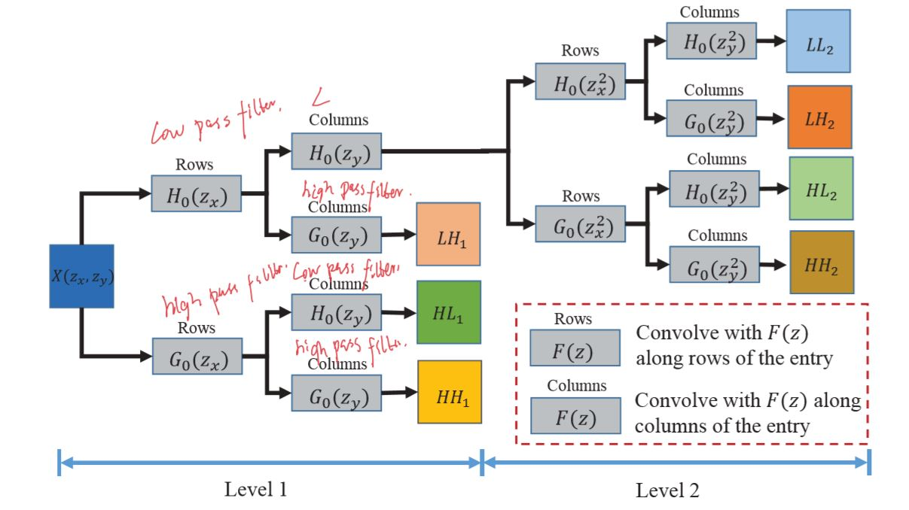
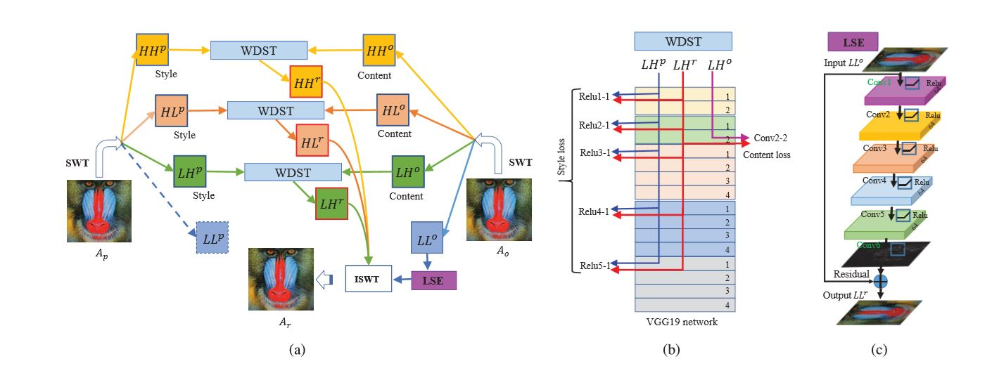

# WDST (wavelet domain style transform )

【整理时间】2019.11.27-2019.11.29

【论文题目】Wavelet Domain Style Transfer for an Effiective Perception-distortion Tradoff in Single Image Super-Resolution

【作者介绍】Xin Deng,Ren Yang, Mai Xu, Pier Luigi Dragotti.

【发表会议】ICCV 2019

【解决问题】

SISR任务期待从一张低分辨率图像重建出高分辨率图像，同时保证精确性和真实性。近来已经证明GAN可以有效的权衡低失真（low distortion）和高感知质量（high perceptual quality）。

本文提出了一种小波域风格转换（wavelet domain style transform）方法可以取得比GAN更好的权衡。固定的小波转换（stationary wavelet transform，SWT）可以将一张图像分解为高频（high-frequency）和低频（low-frequency）子波段。

对于低频子波段，作者通过增强网络来提升目标（objective）质量，

对于高频子波段，作者通过WDST来提升感知（perceptual）质量。

【提出的方法】

【网络结构】

【总结】
此篇论文基于小波域转换下提出了一种很好的方法，解决了SISR任务中的感知失真（perception-distortion）的问题。作者发现目标和感知质量由一张图片的不同要素影响。为了可以更好的权衡他们的关系，作者使用SWT方法将一张图片分别提取出高频和低频信息部分，然后基于不同的目标去优化它们，彼此间是互不影响的。这种分开（divide and conquer）策略证明了图像失真（distortion）和感知（perception）可以很好的权衡（tradeoff）。

最后作者提到未来的工作是使用前馈网络来预测子频段（sub-band）信息。

【我的思考】

这篇文章提出的方法主要针对图像失真和感知如何tadeoff的问题。提出了一种SWT方法，将图片的高频信息和低频信息分别提取出来，然后分别进行优化，最终取得了不错的效果。

但是SWT的过程是比较费时间的，目前代码好像没有开源出来，因此不容易做实验。等有空了，看看是否可以按照论文的细节自己复现一遍代码。

zero-shot学习2018年被提出，但是每次测试的时候都在先训练一个小模型，这个是比较费时的，不知道是不是可以将图片通过小波变换转换到频域进行学习，是不是会加快一点学习速度。

将无监督和小波变换结合会不会产生更好的结果呢？

