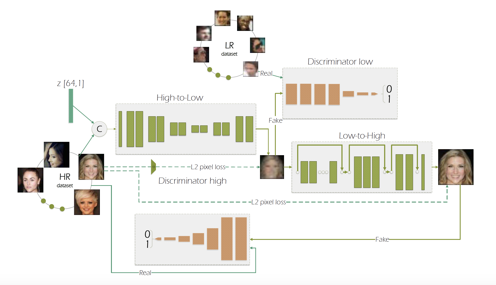

论文题目：To learn image super-resolution, use a GAN to learn how to do image degradation first

作者团队：University of Nottingham

论文链接：https://arxiv.org/pdf/1807.11458.pdf

摘要：当前低分辨率图像主要都是通过简单的bilinear下采样方式得到（或者使用blur模糊核方法），这种构建LR-HR数据集的方法在实际场景中并不能有很好的表现。针对于此问题，作者首先训练了一个High-to-Low GAN来生成低分辨率的图像，在训练过程中使用的是不配对（unpaired）的高低分辨率图像。这个网络训练完成之后，就将这个网络生成的LR与原先的HR进行配对来训练Low-to-High的GAN网络。

主要贡献：

（1）作者首先关注真实生活场景中的超分问题；

（2）作者使用不配对的图像训练了High-to-Low GAN网络，使用配对的网络完成了Low-to-High GAN；

（3）在以往的超分网络中，L2损失占据了很重要的地位，然而会带来图像尖锐的问题。在本文中，作者提出了一种GAN-centered的方法使GAN损失驱动图像构建过程。在High-to-low过程，它用来混合HR图像和噪声；但是在Low-to-High过程中，它被用来去噪。

（4）作者使用提出的方法流程测试基于面部的超分问题，实验证明有很大的提升。

网络整体架构：