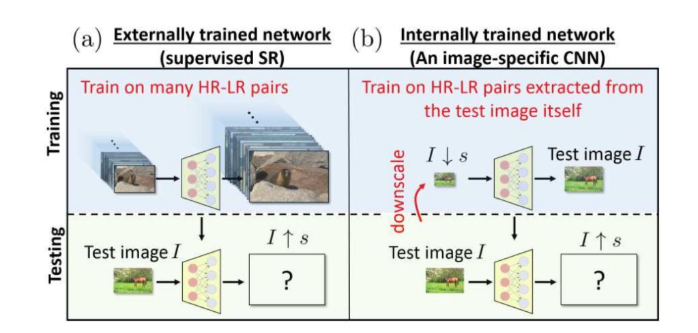

# ZSSR

【整理时间】2019.11.24

【论文题目】“Zero-Shot” Super-Resolution using Deep Internal Learning.

【发表会议】CVPR2018

【作者介绍】

Assaf Shocher∗ 

Nadav Cohen† 

Michal Irani*

【解决问题】

基于监督（supervised）学习的超分方法受限于具体的训练数据，训练数据往往是通过下采样（如bicubic downscaling）得到的，忽略了（sensor noise）。针对于真实场景(non-ideal)的图片，现有最好的模型，往往也不能取得很好的结果。

因此文章提出了第一个unsupervised CNN-based方法，是一种基于zero-shot的学习。不依赖于任何预先的样例和预先的训练。

在测试图片的时候，模型先循环学习输入图片的内部信息，对于每张图片可以采用不同的设置。

在non-ideal(不知道低分辨率图像处理过程)情况下的图片，作者提出的方法要胜任于当前通过外部图像训练得到的模型。

并且此模型可以使用于任何facotr

【网络结构】

此图是监督的SR方法与非监督的SR方法的一个对比：

监督网络需要使用具有大量LR-HR匹配对的数据集进行训练，模型将学习到的外部图像之间的关系。

而非监督学习在测试图像的时候需要将图像下采样，下采样与原图像作为一个匹配对去训练模型，然后再将测试图像输入到网络中，最后得到超分图像，通过这样的无监督学习，更多的是学习到单张图像内部的信息，因此对non-ideal现实中的图像具有更好的鲁棒性。

监督的CNN，需要使用具有比较大并且具有多样性的数据集，需要大量的参数来拟合LR与HR的关系，因此，网络一般设计的极度深并且很复杂。无监督的CNN使用单张图片增强得到的LR-HR作为数据集，因此CNN的规模相对于监督学习的CNN更小。

作者使用了全卷积神经网络，具有8个隐含层，每层有64channel，使用Relu作为激活函数，首先通过插值方法将图像放大到输出图像的大小，作为网络的输入。网络仅仅使用残差结构来学习LR-HR图像的内部关系，使用Adam优化器，学习率设置为0.001

【总结】

此篇论文是首个将无监督学习应用的超分领域的文章，对于每一张图像，在测试的时候先训练一个当前图像的具体网络，此方法可以学习得到图像LR-HR匹配的内部信息，并且通过此方法得到的模型要比监督方法（外部学习）得到的模型，在non-ideal情况下有更好的表现。

【思考】

此论文提出的方法是第一个“Zero-shot”方法，相对于监督的方法在non-ideal情况下有很大的提升，并且无需大量的外部数据的学习，网络的设计也相对来说要小很多。

unsupervised SR值得好好去探索探索。

